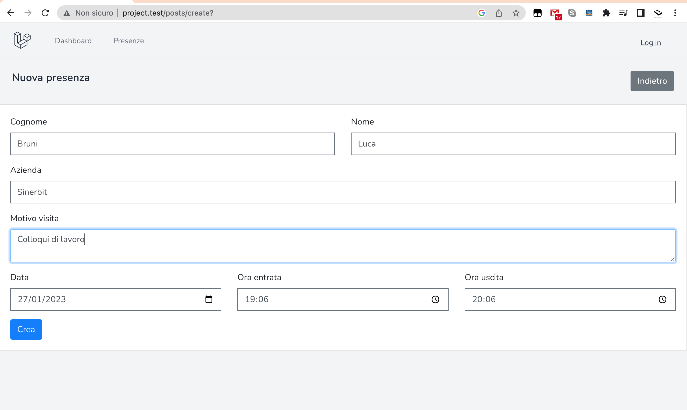
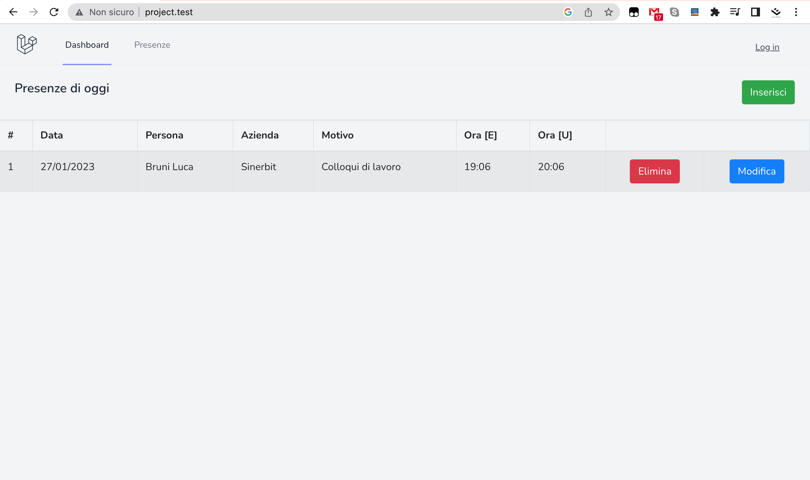
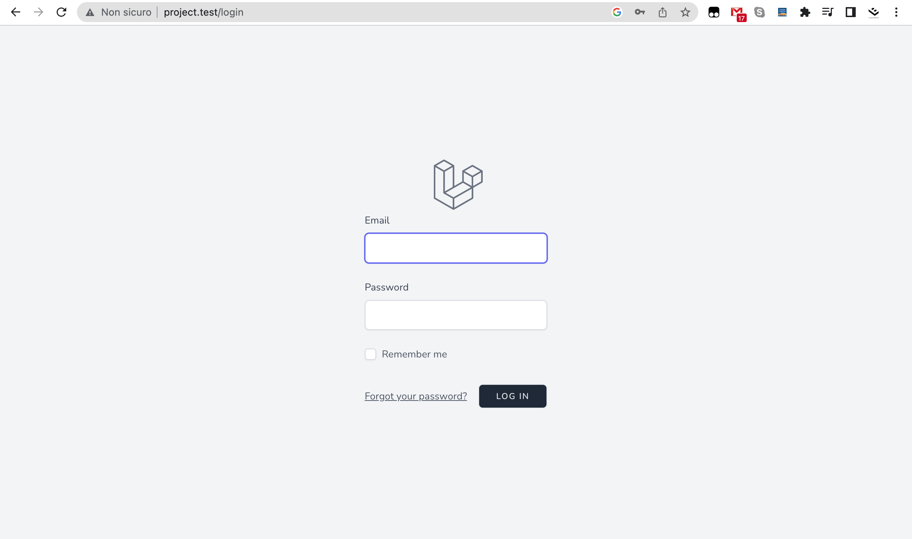
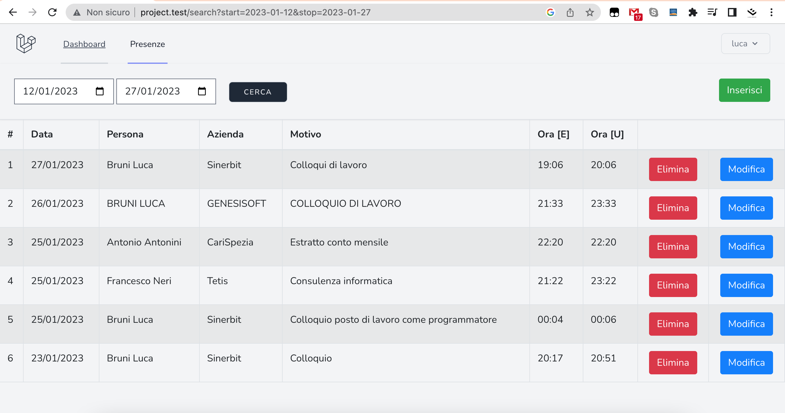

## Progetto

Creare un progetto con l'ultima versione di Laravel, dovrai gestire una base dati in cui il visitatore che entra in azienda deve lasciare i suoi recapiti:

- Nome
- Cognome
- Azienda per cui lavora
- Motivo della visita
- Ora di entrata
- Ora di uscita

Ci sarà una schermata principale dove tutti potranno visualizzare le visite del giorno e
un'area riservata per la segretaria dove può vedere tutte le visite, tramite un filtro per data.

## Funzionamento del servizio

Dalla prima pagina, anche senza aver effettuato la login è possibile visualizzare la lista degli ingressi, e inserire un nuovo ingresso.

Come da richiesta sarà possibile inserire i campi Nome, Cognome, Azienda, Motivo, Data, Ora di entrata ed Ora di uscita.

Sarà possibile modificare o eliminare le uscite sia prima che dopo aver effettuato l'accesso.

Nel momento in cui si decide di visualizzare lo storico delle presenze il sistema richiederà di fare l'accesso.

Una volta effettuato l'accesso sarà possibile visionare lo storico degli ingressi filtrando Da data, A data. 

### Programmi utilizzati

- **[VS Code](https://code.visualstudio.com/Download)**
- **[GitHub Desktop](https://desktop.github.com/)**

### Librerie esterne

- **[maatwebsite/excel](https://laravel-excel.com/)**

### Riferimenti

- **[Laravel 9](https://laravel.com)**
- **[Laravel 9 tutorial - Essentials 101](https://www.youtube.com/watch?v=fvVCB9nUXR0&list=PL6tf8fRbavl2JgMTNY2a6PKtQgKZR362n)**
- **[Devdojo - How to add simple search to your laravel blogwebsite](https://devdojo.com/bobbyiliev/how-to-add-simple-search-to-your-laravel-blogwebsite)**
- **[CoderDave - Your code to GitHub in ONE Click with VisualStudioCode (VSCode Tutorial)](https://www.youtube.com/watch?v=shP-3p-2m6g)**
- **[Html.it - database modelli factory e seed](https://www.html.it/pag/56533/database-modelli-factory-e-seed/)**
- **[GEEKSFORGEEKS - Laravel Import Export Excel file](https://www.geeksforgeeks.org/laravel-import-export-excel-file/amp/)**

## License

The Laravel framework is open-sourced software licensed under the [MIT license](https://opensource.org/licenses/MIT).
